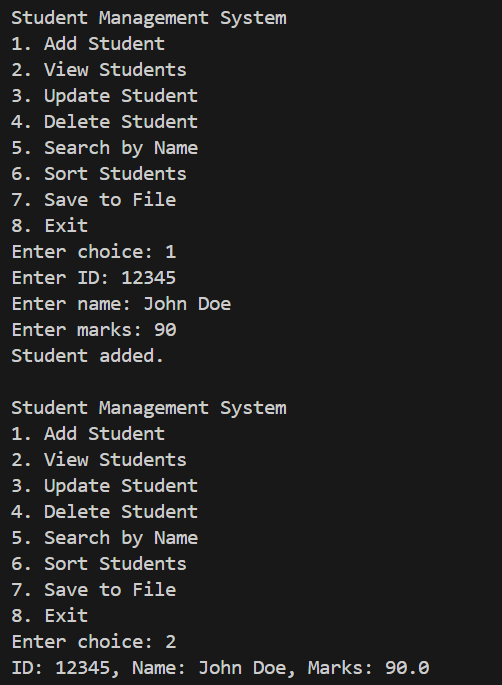
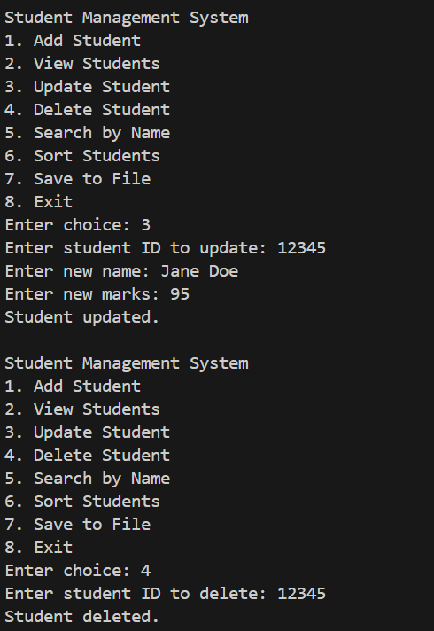
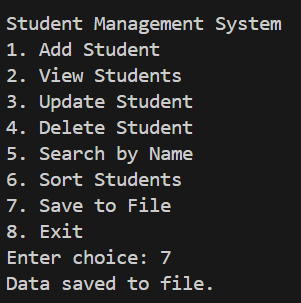

# Student Management System (CLI - Java)

This is a command-line based Java application that manages student records using basic CRUD operations.

## Features

- Add new student records with string ID, name, and marks
- View, update, and delete records by ID
- Search students by name
- Sort students by name or marks
- Save and load data from a file (`students.txt`)

---

## Screenshots

### Adding a Student


### Viewing All Students


### Deleting a Student



---

## How to Run

```bash
javac StudentManagementSystem.java
java StudentManagementSystem
